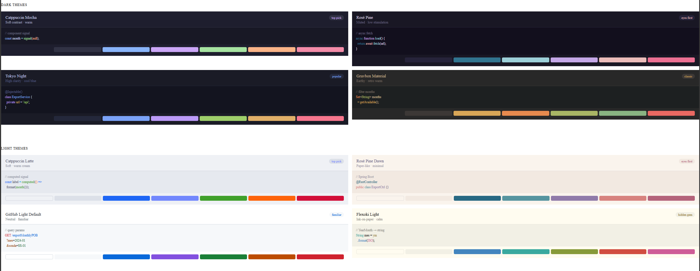

# Nocturne & Daylight

A curated collection of **8 eye-friendly VS Code themes** inspired by Catppuccin, Rosé Pine, Tokyo Night, Gruvbox, GitHub, and Flexoki — designed for **focus, readability, and long coding sessions**.

---

## ✨ Features

* 4 dark themes for low-light environments
* 4 light themes for daytime clarity
* Carefully balanced contrast (no harsh colors)
* Minimal, distraction-free design
* Optimized for long coding sessions

---

## 🎨 Themes

### 🌙 Dark

| Theme                | Character                                            |
| -------------------- | ---------------------------------------------------- |
| **Catppuccin Mocha** | Soft warm contrast with a rich pastel palette        |
| **Rosé Pine**        | Muted tones, low stimulation, perfect for night work |
| **Tokyo Night**      | Crisp contrast with cool blue hues                   |
| **Gruvbox Material** | Retro-inspired warmth with earthy tones              |

---

### ☀️ Light

| Theme                    | Character                           |
| ------------------------ | ----------------------------------- |
| **Catppuccin Latte**     | Creamy background with soft accents |
| **Rosé Pine Dawn**       | Paper-like, calm and elegant        |
| **GitHub Light Default** | Clean, neutral, and familiar        |
| **Flexoki Light**        | Ink-on-paper feel, highly readable  |

---

## 📸 Preview



---

## ⚙️ Installation

### From Marketplace

Search for **"Nocturne & Daylight"** in VS Code Extensions.

### Manual (local dev)

```bash
cp -r dev-themes-vscode ~/.vscode/extensions/
```

Then reload:

* `Ctrl + Shift + P` → **Reload Window**
* `Ctrl + Shift + P` → **Color Theme**

---

## 🚀 Publish

```bash
npm install -g @vscode/vsce
vsce package
vsce publish
```

---

## 🔤 Recommended Fonts

* **JetBrains Mono** (ligatures on) — ideal for JS/TS
* **Geist Mono** — clean and minimal

```json
{
  "editor.fontFamily": "JetBrains Mono",
  "editor.fontLigatures": true,
  "editor.fontSize": 14,
  "editor.lineHeight": 1.6
}
```

---

## 🧠 Philosophy

These themes are built around a simple idea:

> **Your editor should reduce cognitive load, not add to it.**

No aggressive colors. No unnecessary contrast. Just clean, comfortable code.

---

## ⭐ Keywords

VS Code theme, dark theme, light theme, Catppuccin, Rosé Pine, Tokyo Night, Gruvbox, Flexoki, minimal, eye-friendly, developer productivity
